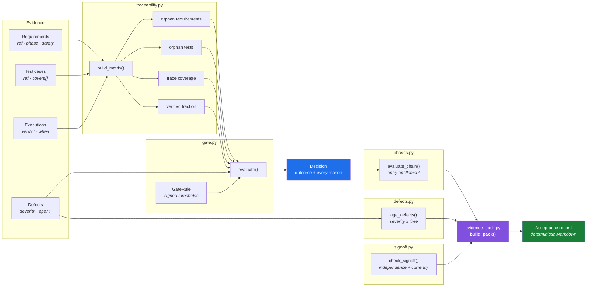

# acceptance-traceability-gate

**A programme can report 100% of tests passing while a third of its requirements were never traced to a test at all.**

Requirements traceability and phase-gate evaluation for field-deployed systems — the machinery behind answering *"can we accept this?"* when the answer is contractual and someone will be asked to justify it eighteen months later.

[](.github/workflows/ci.yml)
[](pyproject.toml)
[](pyproject.toml)
[](LICENSE)

```bash
pip install -e ".[app]" && streamlit run app.py
```

---

## The problem

Handing over a large deployed system — a tolling roadside network, a signalling upgrade, a control centre — ends with an acceptance decision. That decision is worth money, and it gets made from a spreadsheet.

Spreadsheets get three things wrong, reliably:

| Failure | What it looks like | Why it survives review |
|---|---|---|
| **Orphan requirements** | Nobody agreed to verify it, so it never enters the pass rate | Its absence looks like success |
| **Coverage sleight of hand** | "94% coverage" quoted from the *plan*, not the *evidence* | Both numbers are called coverage |
| **Boolean gates** | `ready = True` | Cannot be defended six months later |

## What this does

Takes requirements, test cases, executions and defects. Returns a **graded decision with every contributing reason attached** — never a boolean.

```python
decision = evaluate(matrix, defects, phase=Phase.SITE, rule=GateRule(), at=now)
print(decision.explain())
```

```
WITHHOLD — site phase
  trace coverage :  96.7%
  verified       :  93.3%
  [BLOCK] 2 requirement(s) have no covering test
  [BLOCK] trace coverage 96.7% below required 100.0%
  [BLOCK] verified 93.3% below required 95.0%
  [cond ] 1 requirement(s) have tests neither passed nor failed (blocked or not run)
  [BLOCK] 1 safety-related requirement(s) not fully verified — no threshold applies
  [cond ] 3 open defect(s) carried as conditions
```

## Three decisions that make it work

**Two coverage numbers, always both.** `trace_coverage` counts the intent to verify. `verified_fraction` counts the evidence. The second is always the lower one, and quoting the first as progress is the classic move in an acceptance report.

**Safety sits outside the threshold.** A 95% verified threshold means one in twenty unverified. That is a defensible commercial position and an indefensible safety one, so safety-related requirements are exempt from percentages entirely.

**The gate recommends, it does not sign.** Thresholds are named parameters in a reviewed configuration, not constants buried in a comparison. When a programme argues about whether 92% was good enough, the argument should be about the number someone signed — not about somebody's code.

## Architecture



## The phase chain

A gate is not only *did this phase pass* but *was this phase entitled to start*. Running end-to-end testing while site acceptance is still withheld generates expensive evidence about a configuration that is about to change underneath you.

```
factory ──► site ──► integration ──► end_to_end
   │          │            │              │
   └──────────┴────────────┴──────────────┘
        entry entitlement propagates forward
```

Each phase carries entry criteria as well as exit criteria, and the chain reports the **earliest** phase that has not cleared. Reporting the latest one is a common habit that points the programme at symptoms rather than the upstream cause.

## Defect ageing

Severity alone is a static picture. A CRITICAL raised this morning and a CRITICAL open for eleven weeks are the same row in most defect reports, and they are not the same problem — the first is being worked, the second is being tolerated.

| Tier | Trigger | Who is expected to know |
|---|---|---|
| `working` | inside target | engineering team |
| `overdue` | past target | test manager |
| `escalated` | past 2× target | programme manager |
| `breached` | past 4× target | customer notification |

Targets are per severity (CRITICAL 2d, MAJOR 10d, MINOR 30d, TRIVIAL 90d by default) and live in a signed configuration next to the gate thresholds. Defects sort by **how far past target they are**, not by severity: a MINOR at 4× target needs attention before a fresh MAJOR still inside its commitment.

## Sign-off

A gate decision is an input to a signature, not a substitute for one. Two constraints are enforced rather than assumed:

**Independence** — the party who executed cannot be the sole party who witnesses, and no one person holds two required roles for the same phase. Customer acceptance signed from inside the supplier organisation is flagged. Self-witnessed evidence is a claim, not evidence.

**Currency** — an approval given before the evidence last changed is stale. Approving on Monday and failing a test on Wednesday does not leave you with an approved phase, and a record that says otherwise is worse than no record.

## Evidence pack

The artefact that outlives the programme. Eighteen months after handover somebody asks why a phase was accepted with three defects open, and the answer has to state what was known *at the time*, what rule was applied, and who signed.

`build_pack()` renders plain Markdown in six sections — rule applied, phase chain, traceability, defect position, sign-off, and an explicit *limitations* section. It is deterministic for a given input and states its own thresholds inline, so it can be assessed in fifteen years by someone with no toolchain.

## Interactive demo

`streamlit run app.py` — five tabs: phase chain, phase detail, defect ageing, sign-off, evidence pack (downloadable). Things worth trying:

- Set **open MAJOR = 1** with a workaround, then toggle *Concede MAJOR with workaround*. Same evidence, different outcome — because the concession is a decision, not a default.
- Set **verified threshold to 0.95** and give one safety requirement a blocked test. The threshold is met and it still withholds.
- Fail one **site** test. Watch integration and end-to-end flip to *not entitled to start* while their own tests still pass.
- Tick **same person signs manager + quality**. Complete signatures, invalid record.
- Push **Requirements with no test** to 5 while every executed test passes. 100% pass rate, withheld gate.

## Domain model

```
Requirement   ref · text · phase · verifiable · safety_related
TestCase      ref · title · phase · covers[]      (must cover ≥1 requirement)
Execution     test_ref · verdict · executed_at    (tz-aware, enforced)
Defect        ref · severity · against · closed_at · workaround
Severity      CRITICAL(1) < MAJOR(2) < MINOR(3) < TRIVIAL(4)
Verdict       PASS · FAIL · BLOCKED · NOT_RUN     (BLOCKED ≠ FAIL)
```

`BLOCKED` is not `FAIL`. A blocked test tells you nothing about the requirement; a failed test tells you something specific. Collapsing them corrupts the report in both directions.

## Tests as domain claims

The suite is written so each test name is an assertion about how acceptance works. If one fails, either the code is wrong or the claim is — and finding out which is the point.

```
test_a_requirement_with_no_covering_test_is_an_orphan_not_a_pass
test_one_passing_test_does_not_verify_a_requirement_covered_by_two
test_a_blocked_test_is_indeterminate_rather_than_failed
test_a_retest_supersedes_the_earlier_result
test_an_open_critical_defect_withholds_regardless_of_coverage
test_a_safety_requirement_is_not_subject_to_a_percentage_threshold
test_the_decision_carries_every_reason_it_relied_on
test_a_phase_cannot_clear_while_an_upstream_phase_is_withheld
test_the_chain_reports_the_earliest_failure_not_the_latest
test_two_defects_of_equal_severity_are_not_equal_problems
test_defects_are_ordered_by_how_far_past_target_they_are
test_an_approval_given_before_the_evidence_changed_is_stale
test_one_person_cannot_hold_two_required_roles_for_the_same_phase
test_the_pack_states_the_rule_that_was_applied_at_the_time
```

One of these caught me out while writing it. I asserted that end-to-end's blocked entry would name `site` as the blocker — the phase that actually failed. It names `integration`, its immediate predecessor, which is correct: the chain reports the *local* blocker per phase and the root cause once, via `blocking_phase`. Conflating those is exactly how a status report ends up telling four teams they are the problem. The test now documents the distinction.

## Setup

```bash
git clone https://github.com/SINGHL25/acceptance-traceability-gate
cd acceptance-traceability-gate

python3.12 -m venv .venv && source .venv/bin/activate
pip install -e ".[dev,app]"

pytest -q                      # 38 tests
ruff check . && ruff format --check .
bash scripts/check-sources.sh  # source policy gate
streamlit run app.py
```

**Deploy:** push to GitHub, then [share.streamlit.io](https://share.streamlit.io) → New app → point at `app.py`. `requirements.txt` is already set up for it.

> zsh note: run `bash scripts/check-sources.sh`. Don't paste the script body into zsh — history expansion mangles `#!/usr/bin/env`.

## Source policy

Clean-room. Built from generic systems-engineering practice (ISO/IEC/IEEE 29119 territory), not from any employer or customer document. All demo data is synthetic and seeded. `scripts/check-sources.sh` runs in CI and fails the build on any blocked identifier. See [docs/SOURCE-POLICY.md](docs/SOURCE-POLICY.md).

MIT licensed.
